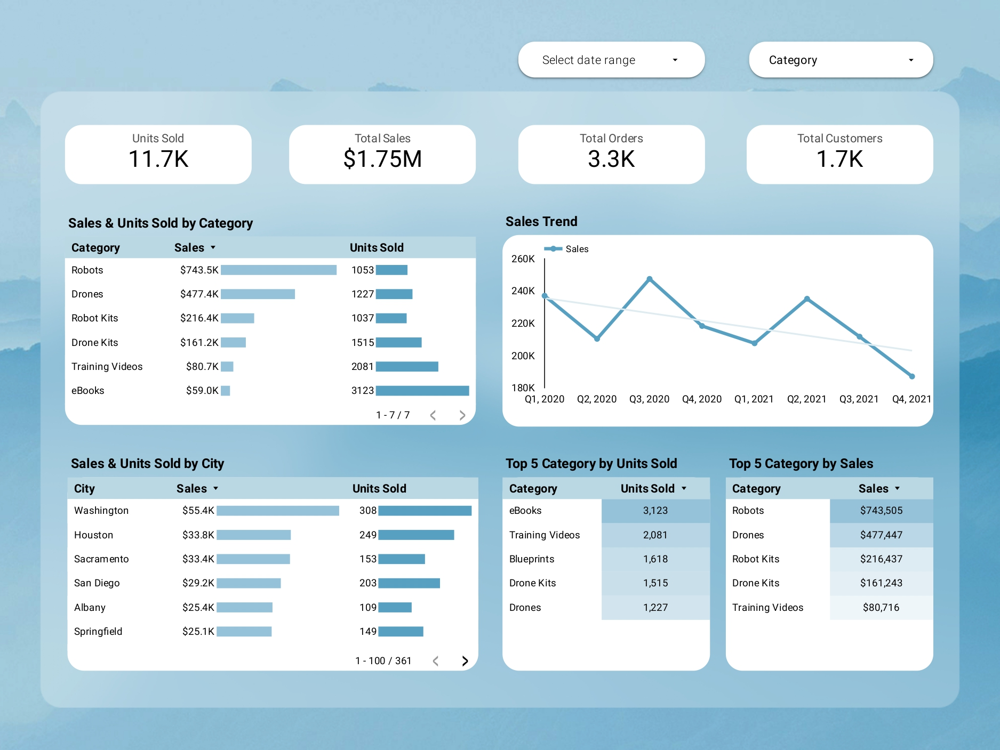

## Sales Analysis(Virtual Internship Project)

### Project Overview
---
Analyzed the sales data of PT Sejahtera Bersama from Q1 2020 to Q4 2021 to understand sales trends, identify top-performing product categories, and provide strategic recommendations to sustain and increase company revenue.

### Key Questions
---
- What is the total overall sales value?
- How does total sales vary by product category?
- What is the total quantity sold by product category?
- How do sales differ by city?
- What is the total quantity sold in each city?
- Which are the top 5 product categories with the highest sales?
- Which are the top 5 product categories with the highest quantity sold?

### Process
---
1. **Data Modelling**
   - Created an Entity Relationship Diagram (ERD) to map relationships between tables.

2. **Data Transformation**
   - Created a Data Mart in BigQuery by merging relevant tables
   - Aggregated price & quantity to calculate total sales

3. **Dashboard Development**
   - Designed canvas using Figma
   - Connected the data mart to Looker Studio and created interactive dashboard.

### Dashboard Preview
---

- <a href="https://lookerstudio.google.com/reporting/fef54180-ba9e-4bc0-b53c-32bbf39bece7"> Interaktive Dashboard</a>

### Insights & Recommendation
---
- Although the robot category generates high revenue, the number of units sold is still low.
  Recommendation: Develop a marketing strategy that includes content showing real-life testimonials or how the product solves specific tasks like automating vacuuming and mopping          schedules during work hours. You can also introduce bundling promotions with robot kits during major online shopping days.
- The most purchased categories are ebooks and training videos, but they contribute less revenue.
  Recommendation: Launch targeted campaigns during key moments such as school/college semester breaks or before civil service exam and aptitude tests for fortune 500 companies. These      campaigns should highlight how training videos help solve skill gaps, and offer bundled videos with related skills to increase value perception.
- Cities like Washington, Houston, and Sacramento show the highest number of transactions, but the average order value is relatively low, suggesting that revenue is spread across many     regions.
  Recommendation: Maximize sales potential in these high-performing areas by running localized Instagram/Facebook ads with special offers or limited-time events tailored to those cities.
